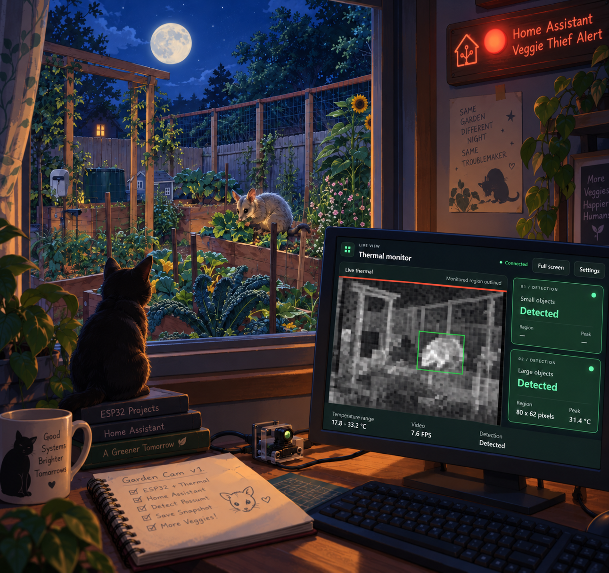
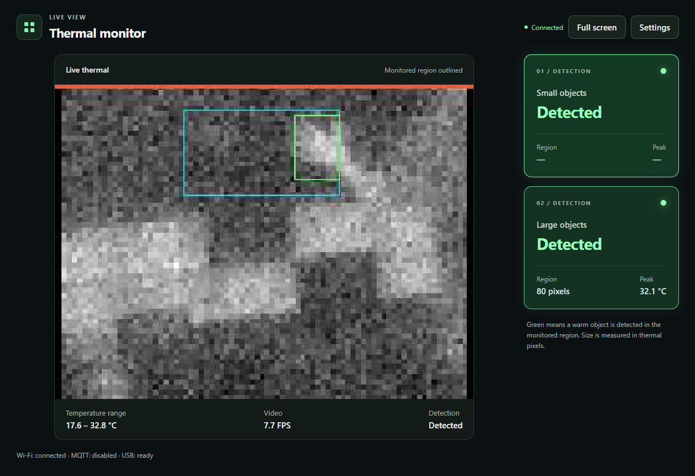
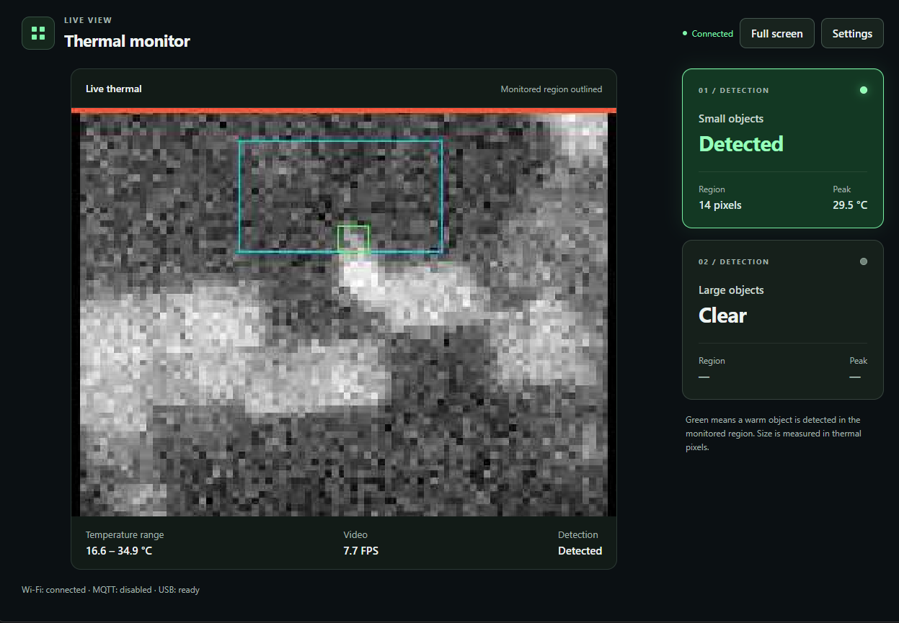
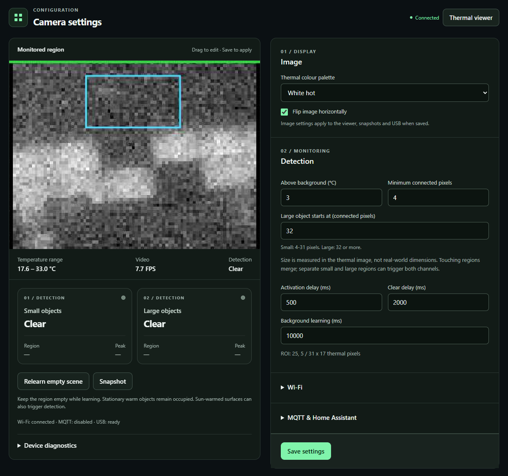

# ESP32 Thermal Security Camera




This project started with a very common problem: a possum kept eating our vegetables. I'd purchased a Waveshare ESP32 Thermal Camera Module a while ago and it had been sitting on my shelf looking for a project. I threw it in my bag to play around with when I had some free time. The result is an experimental thermal camera and occupancy detector that can integrate with Home Assistant.

The firmware uses the module's MI0802 80 × 62 thermal sensor, 16 MB flash and 8 MB OPI PSRAM. It serves a browser-based thermal viewer and settings page, streams uncompressed 80 × 62 YUY2 over native USB and WebSocket, and detects warm regions in a user-selected rectangular region of interest (ROI). Detection continues without a browser connected. MQTT and Home Assistant discovery are available for local integrations.

Firmware **0.3.0** removes JPEG encoding and targets 20 FPS YUY2 video. USB carries a clean grayscale image; the browser scales it and draws thin detection boxes separately. It includes separate **Small objects** and **Large objects** panels in the viewer and settings page. Each reports occupancy, region area and peak temperature, and both remain visible in fullscreen. The two channels classify connected regions by pixel area; they do not identify species or physical size.

**Project status:** Firmware 0.3.0 has been flashed and both 80 × 62 YUY2 streams work on the camera. A short simultaneous run delivered 19.4 FPS over the browser WebSocket and 12.7 FPS over USB DirectShow; USB remains below the 20 FPS target. Browser latency feels imperceptible in hands-on use; end-to-end delay has not yet been measured. Absolute temperature accuracy, long-term operation and reliable detection range remain unverified. See [the validation record](docs/HARDWARE_VALIDATION.md) for completed checks and open items.

## Live demo


https://github.com/user-attachments/assets/b12b31a2-12fd-46f8-abf0-7ed1122a8da8

[▶ Watch the thermal camera demo (MP4)](docs/demo.mp4)

The browser displays the live thermal image with no perceptible delay in hands-on use. Detection boxes are drawn separately over the scaled image, while the USB video stays free of overlays.

## Features

- Browser viewer, settings page, snapshots and configurable palettes.
- Native USB UVC YUY2 video and diagnostic serial console.
- Independent small- and large-region occupancy channels.
- Local MQTT state/events and Home Assistant MQTT discovery.
- Persistent settings, ROI editing and empty-scene relearning.

## Contents

- [Hardware and installation](#arduino-ide-setup)
- [Connect and configure](#first-connection)
- [Viewer and detection](#viewer-and-detection)
- [USB commissioning](#usb-commissioning)
- [MQTT and API](#mqtt-and-api)
- [Build and checks](#reproducible-builds-and-tests)
- [Limitations and safety](#limits)
- [License](#license)

## Arduino IDE setup

1. Add `https://espressif.github.io/arduino-esp32/package_esp32_index.json` to **File > Preferences > Additional boards manager URLs**.
2. In Boards Manager install **esp32 by Espressif Systems, version 3.3.12**. Use its bundled ESP-IDF 5.5.5 libraries; do not install a separate IDF framework or TinyUSB library.
3. Copy the repository's `libraries/WaveshareSenxor` directory into your Arduino sketchbook's `libraries` directory, then restart the IDE. Alternatively run `scripts/package-library.ps1` and install `dist/WaveshareSenxor-0.1.1.zip` with **Sketch > Include Library > Add .ZIP Library**. Replace adapter version 0.1.0 when upgrading: 0.1.1 provides the capture pause/recovery methods needed by firmware 0.2.1. No other Library Manager dependencies are required.
4. Open `firmware/ThermalSecurityCamera/ThermalSecurityCamera.ino`. Keep its adjacent `src` folder intact.
5. Select these **Tools** settings:

| Setting | Value |
| --- | --- |
| Board | ESP32S3 Dev Module |
| CPU frequency | 240 MHz (WiFi) |
| Flash size | 16 MB (128 Mb) |
| Flash mode | QIO 80 MHz |
| PSRAM | OPI PSRAM |
| Partition scheme | 16M Flash (3MB APP/9.9MB FATFS) |
| USB mode | USB-OTG (TinyUSB) |
| USB CDC on boot | Disabled |
| USB DFU / USB firmware MSC on boot | Disabled |
| Upload mode | UART0 / Hardware CDC |
| Upload speed | 115200 initially; 512000 or 921600 for faster Windows uploads once verified |
| Arduino runs on / Events run on | Core 1 / Core 1 |
| Core debug level | None |
| Erase all flash before sketch upload | Disabled |

6. Click **Verify**, then upload using the ROM download port. Hold **BOOT**, press/release **RESET**, then release BOOT. If the board has no reset button, reconnect USB while holding BOOT. Select the newly appearing COM port and upload. Reset after upload if needed.

From firmware 0.1.4, normal native USB exposes the camera and a diagnostic serial COM port together, using the same TinyUSB stack. Keep **USB CDC on boot disabled**: the sketch explicitly registers its own CDC interface. The console accepts newline-terminated commands at 115200 baud; open it with DTR and RTS enabled. `powershell -NoProfile -ExecutionPolicy Bypass -File scripts/usb-command.ps1 -Port COM<n> -Command STATUS` reads health, and `CONFIG` reads redacted configuration. `SET {"flip_horizontal":true}` saves a partial configuration update. `BOOTLOADER` requests ROM download mode; manual BOOT/reset remains the recovery method if the application cannot respond. Composite USB and software bootloader entry passed on the tested board: normal diagnostics use COM13, ROM upload uses COM12 (Windows may assign different numbers elsewhere). From 0.1.5, automatic reset through baud-rate or RTS/DTR changes is disabled; use the explicit command or BOOT/reset. `Serial` log output continues to use UART0. A USB-to-UART bridge cannot carry UVC video: the data cable must reach the S3 native USB pins (D- GPIO19, D+ GPIO20). Verify your board revision against the [Waveshare documentation](https://www.waveshare.com/wiki/Thermal-Camera-ESP32-Module).

## First connection

With no Wi-Fi configured, join **Thermal-<device-id>**. The ID is the 12 lowercase hexadecimal digits of the station MAC, without separators. The setup password is **thermal-<last-six-digits>**, e.g. `thermal-a1b2c3`. Open **http://192.168.4.1/settings**, expand Wi-Fi and save your network settings. After connection the setup AP shuts down. Open the DHCP-assigned IP or `http://thermal-<device-id>.local` where mDNS is supported. If Wi-Fi cannot connect, the setup AP returns after about 30 seconds.

From 0.1.4, unsuccessful station attempts stop after 30 seconds, followed by at least 60 seconds of quiet setup-AP time. Automatic retries wait while a setup client is connected; saving settings explicitly starts a new attempt. Wi-Fi events and memory-allocation failures are available through HTTP status or the USB console.

Draw a rectangle on the image and save it. Settings survive restart in Preferences/NVS. Every successful save restarts background learning and reconnects MQTT. Startup temperatures drift substantially on the tested board, so the thermal build holds detection in `learning` for two minutes from the first valid frame, then performs the configured background learning (10 seconds by default). Video continues and the page shows a warm-up countdown. This is a commissioning safeguard, not proof of calibrated temperature accuracy. Keep the region empty during background learning. **Relearn empty scene** resets the background without changing settings.

Default detection: a region at least **3 degrees C above its per-pixel background**, **4 eight-connected pixels**, present for **500 ms**, absent for **2 seconds**. Background updates have a 60-second time constant and exclude hot candidates, including while stationary. Learning and stale/invalid sensor data produce `learning` and `unavailable`, never an artificial `clear` event. After a frame outage, learning restarts. Persistent sensor faults currently require a board restart.

The image auto-ranges each frame; detection always uses native temperature values. Both transports carry 80 × 62 grayscale YUY2 with no boxes, borders or status stripe. The browser enlarges the image at its native aspect ratio and draws cyan ROI and green small/large region boxes on a separate canvas, using metadata from the same frame. Browser text shows temperatures, generated-frame FPS and health. USB applications perform their own enlargement.

If the image is mirrored, check **Flip image horizontally** and save. This changes the browser stream, snapshots and USB output together. ROI dragging and detection overlays follow the displayed orientation; stored ROI and MQTT coordinates remain native sensor coordinates. The option defaults to off and is saved in Preferences. A USB viewer may also apply its own preview mirroring, so compare with the browser image when choosing the setting.

## Viewer and detection

The main page shows the thermal image beside two detection panels, with controls for full screen and **Settings**. Below 900 pixels wide the panels move below the image. Green means **Detected**, neutral means **Clear**, amber means **Warming up / Learning**, and red means **Unavailable**. Both channels can light together. During the existing clear delay a panel stays green but hides measurements when no current region exists. Status polling continues when video is paused; failed or stale status removes green, with a 2.5-second connection watchdog and request timeout.





`/settings` keeps the preview and draggable ROI together, with compact detection panels underneath. Image and Detection remain expanded; Wi-Fi, MQTT / Home Assistant and diagnostics are collapsible. Changes still require **Save settings**. Select **Fire**, **Ironbow**, **Rainbow**, **White hot** (the new default) or **Black hot**, then save. Colour palettes are applied in the browser. USB and BMP snapshots stay White hot except when Black hot is selected. Existing saved palettes are preserved; temperatures and detection thresholds are unchanged. A save restarts background learning, as in earlier firmware.



**Large object starts at** defaults to **16 connected native pixels**. With the default four-pixel minimum, regions of 4–15 pixels are small and regions of 16 or more are large. Each channel has its own activation/clear timer. Separate small and large regions can occupy both channels; touching regions merge, and crossing the cutoff can leave both channels occupied briefly during the clear delay. Size means area in the thermal image, not physical dimensions or person/animal classification. A cutoff at or below the minimum makes every qualifying region large; a cutoff beyond the ROI's area prevents large detections.

HTTP and MQTT use a trusted local network: there is no login, HTTPS or MQTT TLS in this version. Passwords are stored in ordinary NVS; the configuration API redacts them. The setup password is discoverable from the device ID. Do not expose these endpoints to the Internet.

## USB commissioning

Before the thermal build, set `THERMAL_TEST_PATTERN` to `1` in `firmware/ThermalSecurityCamera/src/BuildOptions.h`, compile and upload. This produces a synthetic scene at 20 FPS and the USB product name **Thermal Camera TEST**; capture applications may list its interface as **Thermal camera**. It needs PSRAM but does not initialize the sensor or publish MQTT. Check enumeration, 80 x 62 YUY2 at 20 FPS, stop/start and reconnect in a UVC capture application. Then restore the flag to `0` and upload the thermal build.

The pinned stock S3 SDK includes `CONFIG_TINYUSB_VIDEO_ENABLED=1`, one video streaming interface and a 64-byte packet buffer. The adapter registers one UVC function with Arduino's existing TinyUSB stack. **No custom board package or second USB stack is required by the build.** The previous MJPEG path passed Windows enumeration, short captures and repeated opens. The new YUY2 descriptors, 80 x 62 resolution, repeated opens and concurrent USB/browser viewing need fresh hardware validation, including Windows Camera and OBS. USB clients may hold the last image during a sensor fault; use HTTP/MQTT health for fault detection.

## MQTT and API

Enter an external broker hostname/IPv4 address, port (default 1883), optional credentials and topic prefix (default `thermal/<device-id>`). All publications use QoS 1:

| Topic suffix | Retained | Contents |
| --- | --- | --- |
| `/availability` | Yes | `online` or `offline`; `offline` is also the last will |
| `/state` | Yes | JSON current state, ROI name, peak temperature and bounds |
| `/event` | No | JSON `occupied`/`clear` transition and unique `event_id` |
| `/small/state`, `/large/state` | Yes | Independent occupancy and largest connected-region size/bounds for each size class |
| `/small/event`, `/large/event` | No | Size-specific occupied/clear transitions with distinct event IDs |

**Home Assistant auto-discovery** defaults to enabled and uses `homeassistant/binary_sensor/thermal_<device-id>/<any|small|large>/config`. Configure the camera and Home Assistant's MQTT integration to use the same broker. Three occupancy entities appear under one device: **Occupancy**, **Small objects** and **Large objects**. Learning and sensor faults make the entities unavailable; device offline availability is also required. Discovery is retained at QoS 1 and republished after reconnect or an `online` birth message on `homeassistant/status`. This release uses Home Assistant's default discovery prefix and birth topic. See [Home Assistant discovery](https://www.home-assistant.io/integrations/mqtt/#mqtt-discovery) and [binary-sensor availability](https://www.home-assistant.io/integrations/binary_sensor.mqtt/#availability_mode).

To remove these entities, turn discovery off and save **while the broker remains configured**; the camera publishes empty retained discovery messages. Turning discovery back on recreates them. Device/entity IDs stay stable when the camera's topic prefix changes on the same broker. Moving to another broker or disabling MQTT prevents automatic cleanup on the old broker; remove those retained records there if needed. Discovery payloads have been checked locally; a live broker/Home Assistant session is still required for end-to-end validation.

Consumers should de-duplicate event IDs because QoS 1 permits duplicates. A new connection publishes the current state and availability. Unsent transitions from an old connection are discarded. State refreshes every 30 seconds; this is occupancy reporting, not a durable event log. See [API and payload details](docs/API.md).

Endpoints: `/`, `/settings`, `/video.js`, WebSocket `/stream.yuy2`, `/snapshot.bmp`, `GET/PUT /api/config`, `GET /api/status`, and `POST /api/relearn`. The former `/stream.mjpg` and `/snapshot.jpg` routes are removed (404). Up to two browser streams share the latest YUY2 frame with USB; each requests one fresh frame at a time, so slow viewers skip frames instead of building a queue. The viewer and settings preview each use one stream. Sensor acquisition/detection run on core 1 independently of streaming and broker reconnection on core 0.

## Reproducible builds and tests

The Arduino IDE is sufficient for normal compilation and upload. For command-line builds, use Arduino CLI and PowerShell from the repository root:

```powershell
powershell -NoProfile -ExecutionPolicy Bypass -File scripts/bootstrap.ps1
powershell -NoProfile -ExecutionPolicy Bypass -File scripts/build.ps1 -ConfigFile arduino-cli.local.yaml
powershell -NoProfile -ExecutionPolicy Bypass -File scripts/build.ps1 -ConfigFile arduino-cli.local.yaml -TestPattern
powershell -NoProfile -ExecutionPolicy Bypass -File scripts/test.ps1
node tests/web_ui_tests.js
node tests/video_tests.js
```

Pass `-Cli 'path/to/arduino-cli.exe'` to bootstrap/build when the CLI is not on PATH. The bootstrap installs 3.3.12 in repository-local `.cache/arduino`, without changing the IDE's installed cores. It downloads the official package's toolchains, including other architectures, so allow several GB. Outputs are in `dist/camera` and `dist/test-pattern`. `-NoUsb` provides a browser-only diagnostic build. Native detector tests need a C++17 `g++` (GCC or LLVM-MinGW).

Native video tests cover YUY2 layout, grayscale levels, mirroring, clean USB pixels, binary metadata and BMP snapshots. After the native tests, `node tests/video_tests.js` verifies the actual browser decoder against a C++-generated frame, including palette rendering, overlays, pacing, timeouts and reconnection. Native detector tests also cover independent size channels, cutoff crossings, merged regions, stationary presence and palette mappings. `node tests/web_ui_tests.js` checks the actual embedded browser scripts with mocked DOM/API interactions: both detection channels, warm-up, learning, stale frames, connection loss/recovery, single-flight polling, request timeout, video pause, fullscreen, explicit saving, password handling and mirrored ROI editing (Node.js is optional for firmware builds). `scripts/check-features.ps1 -BaseUrl http://<device-ip> -Port COM<n>` checks the installed feature build with MQTT disabled: it temporarily changes palettes, size cutoff and discovery, checks BMPs/payloads, restarts the board to test persistence, then restores the original three settings. It performs real settings writes and restarts learning; use it during commissioning with an empty ROI.

On hardware, `scripts/check-api.ps1 -BaseUrl http://<device-ip>` performs bounded, read-only endpoint checks. On Windows, `scripts/check-usb.ps1` opens and closes the DirectShow camera three times and validates the captured frames; FFmpeg and FFprobe must be installed. It measures arrival rate with host timestamps and requests 80 x 62 YUY2 at 20 FPS and requires at least 18 FPS by default; `-MinimumFps 1` records a slow commissioning run without claiming the 20 FPS target. Supply `-Ffmpeg` and `-Ffprobe` with the actual executable paths if your PATH entries are launcher shims, so timeout handling stops the capture process itself. [Validation instructions](docs/HARDWARE_VALIDATION.md) cover MQTT failures, native USB, range and 24-hour operation. See [third-party provenance](THIRD_PARTY.md) for the pinned sensor archive and preserved notices.

For the new browser transport, `scripts/check-video.ps1 -BaseUrl http://<device-ip>` checks raw WebSocket headers/pixels and measures frame arrivals. Run it alongside USB capture when commissioning simultaneous use. After uploading 0.3.0, reconnect USB and select **80 x 62 / YUY2 / 20 FPS** in the capture application. Existing integrations using MJPEG or JPEG URLs must switch to the new endpoints described in [API.md](docs/API.md).

## Limits

Use fixed mounting and continuous USB power. A moving mount, sunshine, warm vegetation, rain, reflections, animals present during learning, and insufficient thermal contrast can change results. Startup learns the scene as it is, including existing occupants. This detects warm regions; it does not classify people or animals, count occupants, track individuals or record video. Small-animal performance at 12 m has not been established. HTTP and MQTT have no authentication, HTTPS or MQTT TLS in this version; keep the device on a trusted local network and do not expose it to the Internet.

## License

Project-authored code and documentation are licensed under the [MIT License](LICENSE). Third-party components retain their own terms and notices; the project license does not grant rights to the bundled vendor sensor archive. See [third-party provenance and notices](THIRD_PARTY.md) before redistributing the complete firmware or repository.
